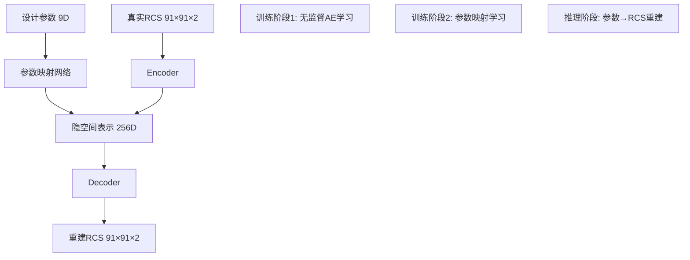
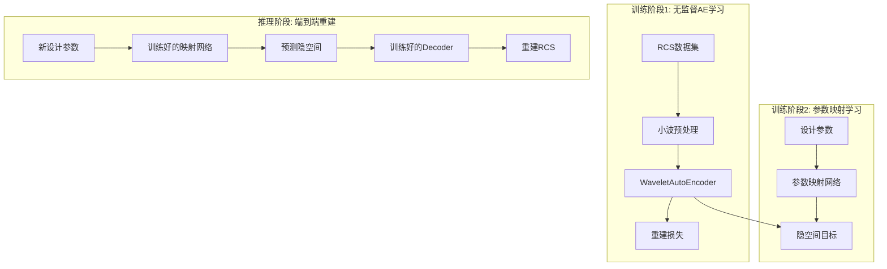

# AutoEncoder-Wavelet RCS重建系统设计文档

## 📋 项目概述

本文档详细描述了在现有RCS小波神经网络框架基础上，开发AutoEncoder系统实现RCS矩阵→隐空间→参数重建的完整方案。

### 🎯 核心目标
- 使用AutoEncoder学习RCS数据的低维表示
- 在隐空间中建立设计参数与RCS特征的映射关系
- 实现从设计参数重构RCS的端到端流程
- 结合小波变换保留多尺度特征信息

---

## 🤔 技术问题解答

### 问题1: AutoEncoder输入格式 - 张量 vs 向量

**回答: 推荐使用张量输入，避免展平为向量**

#### 技术分析:

**✅ 张量输入的优势 (推荐)**:
```python
# RCS输入: [Batch, 91, 91, 2]
# 直接输入到2D卷积层
input_shape = (91, 91, 2)
encoder = nn.Sequential(
    nn.Conv2d(2, 32, 3, padding=1),  # 保持空间结构
    nn.Conv2d(32, 64, 3, stride=2),  # 下采样
    # ...
)
```

**优势**:
1. **保持空间相关性**: 相邻角度的RCS值高度相关
2. **参数效率**: 卷积权重共享，参数量远小于全连接
3. **平移不变性**: 适合处理角度域的周期性特征
4. **多尺度特征**: 天然支持不同尺度的模式识别

**❌ 向量输入的劣势**:
```python
# 需要展平: [Batch, 91*91*2] = [Batch, 16562]
# 全连接层参数量巨大
input_size = 91 * 91 * 2  # 16562
hidden_size = 512
# 第一层权重: 16562 × 512 = 8,479,744 参数!
```

**劣势**:
1. **丢失空间结构**: 展平后相邻位置信息丢失
2. **参数爆炸**: 第一层全连接就需要800万+参数
3. **过拟合风险**: 参数量过大，容易过拟合小数据集
4. **计算开销**: 内存占用和计算量巨大

#### 推荐架构:
```python
class CNN_AutoEncoder(nn.Module):
    def __init__(self):
        super().__init__()
        # Encoder: 保持空间结构的下采样
        self.encoder = nn.Sequential(
            nn.Conv2d(2, 32, 3, padding=1),    # [91,91,2] -> [91,91,32]
            nn.ReLU(), nn.BatchNorm2d(32),
            nn.Conv2d(32, 64, 3, stride=2),    # -> [46,46,64]
            nn.ReLU(), nn.BatchNorm2d(64),
            nn.Conv2d(64, 128, 3, stride=2),   # -> [23,23,128]
            nn.ReLU(), nn.BatchNorm2d(128),
            nn.AdaptiveAvgPool2d((4, 4)),      # -> [4,4,128]
            nn.Flatten(),                       # -> [2048]
            nn.Linear(2048, 256)               # -> [256] 隐空间
        )

        # Decoder: 从隐空间重建空间结构
        self.decoder = nn.Sequential(
            nn.Linear(256, 2048),
            nn.Unflatten(1, (128, 4, 4)),      # -> [128,4,4]
            nn.ConvTranspose2d(128, 64, 4, stride=2),  # -> [64,10,10]
            nn.ReLU(), nn.BatchNorm2d(64),
            nn.ConvTranspose2d(64, 32, 4, stride=2),   # -> [32,22,22]
            nn.ReLU(), nn.BatchNorm2d(32),
            nn.Upsample((91, 91), mode='bilinear'),    # -> [32,91,91]
            nn.Conv2d(32, 2, 3, padding=1),           # -> [2,91,91]
            nn.Softplus()  # 确保输出非负
        )
```

### 问题2: 框架兼容性分析

**回答: 现有框架完全兼容，建议采用混合架构**

#### 兼容性分析:

**当前架构**: `参数(9维) → 神经网络 → RCS(91×91×2)`
**新增架构**: `RCS(91×91×2) → AutoEncoder → 隐空间(256维) ← 参数映射 ← 参数(9维)`

#### 混合架构设计:



#### 复用现有模块:

1. **数据加载**: `data_loader.py` - 完全复用
2. **预处理**: `preprocessing.py` - RCS数据标准化
3. **可视化**: `visualization.py` - RCS图像显示
4. **评估指标**: `evaluation.py` - MSE, SSIM等指标
5. **GUI框架**: `gui.py` - 新增AE标签页

#### 新增模块结构:
```
autoencoder/
├── models/
│   ├── cnn_autoencoder.py      # CNN-AE核心模型
│   ├── parameter_mapper.py     # 参数→隐空间映射
│   └── hybrid_model.py         # 端到端混合模型
├── training/
│   ├── ae_trainer.py           # AE训练器
│   └── hybrid_trainer.py       # 混合训练器
└── evaluation/
    └── ae_evaluator.py         # AE专用评估
```

### 问题3: 小波与AutoEncoder结合策略

**回答: 推荐方案A - 小波预处理+单AE，简单有效**

#### 方案对比分析:

### 🥇 **方案A: 小波预处理 + 单AutoEncoder (推荐)**

```python
# 小波变换预处理
def wavelet_preprocess(rcs_data):
    """
    输入: [B, 91, 91, 2]
    输出: [B, 91, 91, 8]  # 2频率 × 4小波频带
    """
    wavelet_bands = []
    for freq_idx in range(2):  # 1.5GHz, 3GHz
        freq_data = rcs_data[:, :, :, freq_idx]

        # 4频带小波分解
        coeffs = pywt.dwt2(freq_data, 'db4')
        LL, (LH, HL, HH) = coeffs

        wavelet_bands.extend([LL, LH, HL, HH])

    return torch.stack(wavelet_bands, dim=-1)  # [B, 91, 91, 8]

# 单一AE处理多频带信息
class WaveletAutoEncoder(nn.Module):
    def __init__(self):
        super().__init__()
        self.encoder = CNN_Encoder(input_channels=8)  # 8频带输入
        self.decoder = CNN_Decoder(output_channels=8)

    def forward(self, x):
        # x: [B, 91, 91, 8] 小波系数
        latent = self.encoder(x)      # -> [B, 256]
        recon = self.decoder(latent)  # -> [B, 91, 91, 8]
        return recon, latent
```

**优势**:
- ✅ **保留多尺度信息**: 4个频带捕获不同尺度特征
- ✅ **统一隐空间**: 便于参数映射和分析
- ✅ **实现简单**: 只需一个AE网络
- ✅ **计算高效**: 相比多网络方案更轻量

### 🥈 **方案B: 多尺度CNN-AutoEncoder**

```python
class MultiScaleAutoEncoder(nn.Module):
    def __init__(self):
        super().__init__()
        # 不同尺度的卷积分支
        self.scale1 = nn.Conv2d(2, 32, 3, padding=1)   # 细节
        self.scale2 = nn.Conv2d(2, 32, 5, padding=2)   # 中等
        self.scale3 = nn.Conv2d(2, 32, 7, padding=3)   # 粗糙

        self.fusion = nn.Conv2d(96, 64, 1)  # 特征融合
        self.encoder = CNN_Encoder(input_channels=64)
```

**特点**:
- 😐 **多尺度卷积**: 并行处理不同尺度
- 😐 **特征融合**: 需要设计融合策略
- ❌ **复杂度高**: 网络结构更复杂

### 🥉 **方案C: 分层AutoEncoder**

```python
class HierarchicalAutoEncoder(nn.Module):
    def __init__(self):
        super().__init__()
        self.coarse_ae = AutoEncoder(channels=2)    # 低频AE
        self.detail_ae = AutoEncoder(channels=2)    # 高频AE

    def forward(self, x):
        # 分频处理
        x_coarse = F.avg_pool2d(x, 2)  # 低频
        x_detail = x - F.upsample(x_coarse, scale_factor=2)  # 高频差

        latent_coarse = self.coarse_ae.encode(x_coarse)
        latent_detail = self.detail_ae.encode(x_detail)

        return torch.cat([latent_coarse, latent_detail], dim=1)
```

**特点**:
- 😐 **分层表示**: 低频+高频分离
- ❌ **双隐空间**: 增加分析复杂度
- ❌ **训练复杂**: 需要平衡两个AE的训练

#### 推荐决策:

**选择方案A的理由**:
1. **简单性**: 单一隐空间，便于参数映射
2. **有效性**: 小波变换天然保留多尺度信息
3. **可解释性**: 隐空间维度统一，便于分析
4. **扩展性**: 后续可以轻松添加更多小波基函数

---

## 🏗️ 系统架构设计

### 整体架构图



### 核心组件设计

#### 1. 小波预处理模块

```python
class WaveletTransform:
    def __init__(self, wavelet='db4', levels=1):
        self.wavelet = wavelet
        self.levels = levels

    def forward_transform(self, rcs_data):
        """RCS → 小波系数"""
        batch_size = rcs_data.shape[0]
        wavelet_coeffs = []

        for freq_idx in range(2):  # 两个频率
            freq_data = rcs_data[:, :, :, freq_idx]

            for batch_idx in range(batch_size):
                coeffs = pywt.dwt2(freq_data[batch_idx], self.wavelet)
                LL, (LH, HL, HH) = coeffs
                wavelet_coeffs.append([LL, LH, HL, HH])

        return self.stack_coefficients(wavelet_coeffs)

    def inverse_transform(self, wavelet_coeffs):
        """小波系数 → RCS"""
        # 逆变换重建原始RCS
        pass
```

#### 2. CNN-AutoEncoder核心

```python
class WaveletAutoEncoder(nn.Module):
    def __init__(self, latent_dim=256):
        super().__init__()

        # Encoder: 8通道小波系数 → 隐空间
        self.encoder = nn.Sequential(
            # 第一层: 8通道小波系数输入
            nn.Conv2d(8, 32, 3, padding=1),    # [91,91,8] -> [91,91,32]
            nn.ReLU(), nn.BatchNorm2d(32),

            # 下采样层
            nn.Conv2d(32, 64, 3, stride=2),    # -> [46,46,64]
            nn.ReLU(), nn.BatchNorm2d(64),

            nn.Conv2d(64, 128, 3, stride=2),   # -> [23,23,128]
            nn.ReLU(), nn.BatchNorm2d(128),

            nn.Conv2d(128, 256, 3, stride=2),  # -> [12,12,256]
            nn.ReLU(), nn.BatchNorm2d(256),

            # 全局池化 + 全连接
            nn.AdaptiveAvgPool2d((4, 4)),      # -> [4,4,256]
            nn.Flatten(),                       # -> [4096]
            nn.Linear(4096, 1024),
            nn.ReLU(), nn.Dropout(0.2),
            nn.Linear(1024, latent_dim)        # -> [256] 隐空间
        )

        # Decoder: 隐空间 → 8通道小波系数
        self.decoder = nn.Sequential(
            nn.Linear(latent_dim, 1024),
            nn.ReLU(), nn.Dropout(0.2),
            nn.Linear(1024, 4096),
            nn.ReLU(),
            nn.Unflatten(1, (256, 4, 4)),      # -> [256,4,4]

            # 上采样层
            nn.ConvTranspose2d(256, 128, 4, stride=2, padding=1),  # -> [128,8,8]
            nn.ReLU(), nn.BatchNorm2d(128),

            nn.ConvTranspose2d(128, 64, 4, stride=2, padding=1),   # -> [64,16,16]
            nn.ReLU(), nn.BatchNorm2d(64),

            nn.ConvTranspose2d(64, 32, 4, stride=2, padding=1),    # -> [32,32,32]
            nn.ReLU(), nn.BatchNorm2d(32),

            # 最终上采样到原始尺寸
            nn.Upsample((91, 91), mode='bilinear', align_corners=False),
            nn.Conv2d(32, 8, 3, padding=1),    # -> [8,91,91]
            nn.Tanh()  # 小波系数可能有负值
        )

    def encode(self, x):
        return self.encoder(x)

    def decode(self, latent):
        return self.decoder(latent)

    def forward(self, x):
        latent = self.encode(x)
        recon = self.decode(latent)
        return recon, latent
```

#### 3. 参数映射网络

```python
class ParameterMapper(nn.Module):
    """设计参数 → 隐空间映射"""

    def __init__(self, param_dim=9, latent_dim=256):
        super().__init__()

        # 支持多种映射策略
        self.mapping_type = 'mlp'  # 'mlp', 'random_forest', 'xgboost'

        if self.mapping_type == 'mlp':
            self.mlp = nn.Sequential(
                nn.Linear(param_dim, 128),
                nn.ReLU(), nn.BatchNorm1d(128), nn.Dropout(0.2),

                nn.Linear(128, 256),
                nn.ReLU(), nn.BatchNorm1d(256), nn.Dropout(0.2),

                nn.Linear(256, 512),
                nn.ReLU(), nn.BatchNorm1d(512), nn.Dropout(0.2),

                nn.Linear(512, latent_dim)
            )

    def forward(self, params):
        """
        输入: [B, 9] 设计参数
        输出: [B, 256] 隐空间表示
        """
        if self.mapping_type == 'mlp':
            return self.mlp(params)
        # 其他映射方法的实现...
```

#### 4. 混合训练系统

```python
class HybridTrainer:
    def __init__(self, autoencoder, parameter_mapper):
        self.autoencoder = autoencoder
        self.parameter_mapper = parameter_mapper

        # 损失函数
        self.reconstruction_loss = nn.MSELoss()
        self.mapping_loss = nn.MSELoss()

    def train_stage1_autoencoder(self, rcs_dataloader, epochs=100):
        """阶段1: 无监督AE训练"""
        self.autoencoder.train()

        for epoch in range(epochs):
            total_loss = 0
            for batch_rcs in rcs_dataloader:
                # 小波预处理
                wavelet_rcs = self.wavelet_transform(batch_rcs)

                # AE前向传播
                recon_wavelet, latent = self.autoencoder(wavelet_rcs)

                # 重建损失
                loss = self.reconstruction_loss(recon_wavelet, wavelet_rcs)

                # 反向传播
                self.ae_optimizer.zero_grad()
                loss.backward()
                self.ae_optimizer.step()

                total_loss += loss.item()

            print(f"Stage1 Epoch {epoch}: Loss = {total_loss:.6f}")

    def train_stage2_mapping(self, param_rcs_dataloader, epochs=50):
        """阶段2: 参数映射训练"""
        self.autoencoder.eval()  # 冻结AE
        self.parameter_mapper.train()

        for epoch in range(epochs):
            total_loss = 0
            for batch_params, batch_rcs in param_rcs_dataloader:
                # 获取目标隐空间表示
                with torch.no_grad():
                    wavelet_rcs = self.wavelet_transform(batch_rcs)
                    target_latent = self.autoencoder.encode(wavelet_rcs)

                # 参数映射预测
                pred_latent = self.parameter_mapper(batch_params)

                # 映射损失
                loss = self.mapping_loss(pred_latent, target_latent)

                # 反向传播
                self.mapper_optimizer.zero_grad()
                loss.backward()
                self.mapper_optimizer.step()

                total_loss += loss.item()

            print(f"Stage2 Epoch {epoch}: Loss = {total_loss:.6f}")

    def train_end_to_end(self, param_rcs_dataloader, epochs=20):
        """阶段3: 端到端微调"""
        self.autoencoder.train()
        self.parameter_mapper.train()

        for epoch in range(epochs):
            for batch_params, batch_rcs in param_rcs_dataloader:
                # 端到端前向传播
                pred_latent = self.parameter_mapper(batch_params)
                recon_wavelet = self.autoencoder.decode(pred_latent)

                # 重建目标
                target_wavelet = self.wavelet_transform(batch_rcs)

                # 端到端损失
                loss = self.reconstruction_loss(recon_wavelet, target_wavelet)

                # 反向传播
                self.end_to_end_optimizer.zero_grad()
                loss.backward()
                self.end_to_end_optimizer.step()
```

---

## 📊 实验设计与评估

### 对比实验设计

#### 1. AutoEncoder架构对比
- **基础CNN-AE**: 不使用小波预处理
- **小波增强AE**: 方案A - 8通道小波输入
- **多尺度AE**: 方案B - 多尺度卷积
- **分层AE**: 方案C - 低频+高频分离

#### 2. 隐空间维度实验
- 64维, 128维, 256维, 512维
- 分析维度对重建质量和映射精度的影响

#### 3. 参数映射方法对比
- **深度学习**: MLP, ResNet-style
- **机器学习**: RandomForest, XGBoost, SVR
- **混合方法**: 深度特征提取 + 传统映射

#### 4. 小波基函数对比
- Daubechies: db1, db4, db8
- Haar, Biorthogonal, Coiflets
- 分析对高频特征保留的影响

### 评估指标体系

#### 1. 重建质量指标
```python
def evaluate_reconstruction(pred_rcs, true_rcs):
    # 像素级误差
    mse = F.mse_loss(pred_rcs, true_rcs)
    mae = F.l1_loss(pred_rcs, true_rcs)

    # 结构相似性
    ssim = structural_similarity(pred_rcs, true_rcs)

    # 频域一致性
    pred_fft = torch.fft.fft2(pred_rcs)
    true_fft = torch.fft.fft2(true_rcs)
    freq_error = F.mse_loss(torch.abs(pred_fft), torch.abs(true_fft))

    # 物理约束满足度
    symmetry_error = check_symmetry_constraint(pred_rcs)

    return {
        'mse': mse.item(),
        'mae': mae.item(),
        'ssim': ssim,
        'freq_error': freq_error.item(),
        'symmetry_error': symmetry_error
    }
```

#### 2. 隐空间质量分析
```python
def analyze_latent_space(autoencoder, dataloader):
    latent_vectors = []
    parameters = []

    for params, rcs in dataloader:
        with torch.no_grad():
            wavelet_rcs = wavelet_transform(rcs)
            latent = autoencoder.encode(wavelet_rcs)
            latent_vectors.append(latent)
            parameters.append(params)

    latent_vectors = torch.cat(latent_vectors)
    parameters = torch.cat(parameters)

    # 线性可分性分析
    linearity_score = analyze_linearity(latent_vectors, parameters)

    # 聚类质量
    cluster_score = analyze_clustering(latent_vectors, parameters)

    # 维度利用率
    dimension_usage = analyze_dimension_usage(latent_vectors)

    return {
        'linearity': linearity_score,
        'clustering': cluster_score,
        'dim_usage': dimension_usage
    }
```

#### 3. 端到端性能评估
```python
def evaluate_end_to_end(param_mapper, autoencoder, test_params, test_rcs):
    # 参数 → 隐空间 → RCS重建
    with torch.no_grad():
        pred_latent = param_mapper(test_params)
        pred_wavelet = autoencoder.decode(pred_latent)
        pred_rcs = inverse_wavelet_transform(pred_wavelet)

    # 与现有直接映射网络对比
    direct_pred_rcs = existing_network(test_params)

    # 性能对比
    ae_metrics = evaluate_reconstruction(pred_rcs, test_rcs)
    direct_metrics = evaluate_reconstruction(direct_pred_rcs, test_rcs)

    return {
        'autoencoder_approach': ae_metrics,
        'direct_approach': direct_metrics,
        'improvement': calculate_improvement(ae_metrics, direct_metrics)
    }
```

---

## 🚀 开发实施计划

### 🗓️ 时间线安排 (预计7-8天)

#### 阶段1: 基础AutoEncoder开发 (2天)
**目标**: 建立CNN-AE基础架构

**任务清单**:
- [ ] 创建`autoencoder/models/cnn_autoencoder.py`
- [ ] 实现小波变换工具`autoencoder/utils/wavelet_transform.py`
- [ ] 基础训练循环`autoencoder/training/ae_trainer.py`
- [ ] 数据加载适配器(RCS输入模式)
- [ ] 基础重建质量评估

**验收标准**:
- AE能够成功重建RCS数据，MSE < 0.1
- 隐空间维度可配置(64-512)
- 支持小波预处理和原始输入对比

#### 阶段2: 小波集成优化 (1天)
**目标**: 完善小波-AE结合方案

**任务清单**:
- [ ] 多种小波基函数对比(db1,db4,db8,haar)
- [ ] 优化小波系数的归一化和预处理
- [ ] 实现方案A,B,C的对比实验
- [ ] 频域特征保留分析

**验收标准**:
- 确定最优小波基函数和参数配置
- 小波增强AE明显优于基础CNN-AE
- 高频特征保留效果良好

#### 阶段3: 参数映射网络 (2天)
**目标**: 实现参数→隐空间映射

**任务清单**:
- [ ] MLP映射网络`autoencoder/models/parameter_mapper.py`
- [ ] 随机森林映射器(scikit-learn集成)
- [ ] XGBoost映射器对比实验
- [ ] 映射质量评估指标
- [ ] 超参数搜索和优化

**验收标准**:
- 参数映射精度达到合理水平
- 多种映射方法性能对比完成
- 隐空间-参数关系可解释性分析

#### 阶段4: 端到端训练系统 (1天)
**目标**: 完整训练流水线

**任务清单**:
- [ ] 混合训练器`autoencoder/training/hybrid_trainer.py`
- [ ] 两阶段训练策略实现
- [ ] 端到端微调流程
- [ ] 训练过程监控和可视化
- [ ] 模型保存和加载机制

**验收标准**:
- 完整的训练流水线能够运行
- 端到端重建效果优于分阶段训练
- 训练过程稳定，收敛良好

#### 阶段5: GUI集成和可视化 (1-2天)
**目标**: 集成到现有界面系统

**任务清单**:
- [ ] 新增"AutoEncoder训练"标签页
- [ ] 隐空间可视化(t-SNE/UMAP/PCA)
- [ ] 参数→RCS重建演示界面
- [ ] AE vs 直接映射对比可视化
- [ ] 训练过程实时监控界面

**验收标准**:
- GUI界面美观易用
- 隐空间可视化清晰直观
- 实时训练监控功能正常

### 🎯 里程碑检查点

#### Milestone 1 (2天后): 基础AE可用
- ✅ CNN-AutoEncoder能够重建RCS
- ✅ 小波预处理模块工作正常
- ✅ 基础评估指标可计算

#### Milestone 2 (4天后): 参数映射完成
- ✅ 参数→隐空间映射训练成功
- ✅ 多种映射方法对比完成
- ✅ 隐空间可解释性分析完成

#### Milestone 3 (6天后): 端到端流程可用
- ✅ 参数→RCS完整重建流程
- ✅ 与现有网络性能对比
- ✅ 主要评估指标达标

#### Milestone 4 (8天后): 系统完整集成
- ✅ GUI集成完成
- ✅ 用户友好的操作界面
- ✅ 完整文档和使用说明

---

## 🔧 代码文件结构

### 新增模块组织

```
autoencoder/                           # AutoEncoder主模块
├── __init__.py                        # 模块初始化
├── models/                            # 网络模型定义
│   ├── __init__.py
│   ├── cnn_autoencoder.py            # CNN-AutoEncoder核心
│   ├── wavelet_ae.py                 # 小波增强AutoEncoder
│   ├── parameter_mapper.py           # 参数映射网络
│   ├── hybrid_model.py               # 端到端混合模型
│   └── model_utils.py                # 模型工具函数
├── training/                          # 训练相关
│   ├── __init__.py
│   ├── ae_trainer.py                 # AutoEncoder训练器
│   ├── mapper_trainer.py             # 参数映射训练器
│   ├── hybrid_trainer.py             # 混合训练器
│   └── training_utils.py             # 训练工具函数
├── evaluation/                        # 评估分析
│   ├── __init__.py
│   ├── ae_evaluator.py               # AutoEncoder评估
│   ├── reconstruction_metrics.py     # 重建质量指标
│   ├── latent_analysis.py            # 隐空间分析
│   └── comparison_tools.py           # 性能对比工具
├── utils/                             # 工具模块
│   ├── __init__.py
│   ├── wavelet_transform.py          # 小波变换工具
│   ├── data_adapters.py              # 数据适配器
│   ├── visualization.py              # AE专用可视化
│   └── config.py                     # AE配置管理
└── configs/                           # 配置文件
    ├── ae_config.yaml                # AutoEncoder配置
    ├── training_config.yaml          # 训练配置
    └── experiment_configs/            # 实验配置
        ├── basic_ae.yaml
        ├── wavelet_ae.yaml
        └── hybrid_model.yaml
```

### 与现有框架的集成点

#### 1. 数据层集成
```python
# 现有: data_loader.py
# 扩展: autoencoder/utils/data_adapters.py

class AE_DataAdapter:
    def __init__(self, original_loader):
        self.original_loader = original_loader

    def get_rcs_only_loader(self):
        """仅RCS数据，用于无监督AE训练"""
        pass

    def get_param_rcs_pairs(self):
        """参数-RCS对，用于映射训练"""
        pass
```

#### 2. 评估系统集成
```python
# 现有: evaluation.py
# 扩展: autoencoder/evaluation/ae_evaluator.py

class UnifiedEvaluator:
    def __init__(self):
        self.traditional_evaluator = TraditionalEvaluator()
        self.ae_evaluator = AE_Evaluator()

    def compare_approaches(self, test_data):
        """对比传统方法和AE方法"""
        pass
```

#### 3. GUI界面集成
```python
# 现有: gui.py
# 扩展: 新增AutoEncoder标签页

def create_autoencoder_tab(self):
    """创建AutoEncoder训练和分析标签页"""
    # AE训练控制
    # 隐空间可视化
    # 参数重建演示
    # 性能对比展示
    pass
```

### 配置管理扩展

#### AutoEncoder专用配置
```yaml
# autoencoder/configs/ae_config.yaml
autoencoder:
  model:
    latent_dim: 256
    input_channels: 8  # 小波系数通道数
    architecture: "wavelet_enhanced"  # basic_cnn, wavelet_enhanced, multiscale

  wavelet:
    wavelet_type: "db4"
    levels: 1
    mode: "symmetric"

  training:
    stage1_epochs: 100  # AE无监督训练
    stage2_epochs: 50   # 参数映射训练
    stage3_epochs: 20   # 端到端微调

    stage1_lr: 1e-3
    stage2_lr: 1e-4
    stage3_lr: 1e-5

    batch_size: 32
    weight_decay: 1e-5

parameter_mapping:
  method: "mlp"  # mlp, random_forest, xgboost, hybrid

  mlp:
    hidden_dims: [128, 256, 512]
    dropout: 0.2
    activation: "relu"

  random_forest:
    n_estimators: 100
    max_depth: 10

evaluation:
  metrics:
    - "mse"
    - "mae"
    - "ssim"
    - "freq_consistency"
    - "symmetry_error"

  visualization:
    latent_space_method: "tsne"  # tsne, umap, pca
    comparison_plots: true
```

---

## 💡 预期效果与创新点

### 🎯 预期改进效果

#### 1. 重建质量提升
- **空间结构保持**: CNN保持RCS空间相关性
- **多尺度特征**: 小波变换捕获不同频率成分
- **物理约束**: 隐空间表示自然满足对称性等约束

#### 2. 参数空间理解
- **可解释隐空间**: 256维隐空间比16562维原始空间更易分析
- **参数关系发现**: 隐空间中的聚类可能揭示设计参数的隐含分组
- **插值能力**: 隐空间插值生成中间设计的RCS

#### 3. 计算效率优化
- **压缩表示**: 91×91×2 → 256维，压缩比65:1
- **快速推理**: 参数→隐空间→RCS比端到端训练更快
- **迁移学习**: 预训练的AE可用于新的参数空间

### 🚀 技术创新点

#### 1. 小波-AutoEncoder融合
- **首次**将小波多分辨率分析与CNN-AE结合用于RCS重建
- 同时保留频域和空间域特征
- 自适应频带权重学习

#### 2. 混合架构设计
- 两阶段训练策略：无监督预训练 + 监督微调
- 支持多种参数映射方法的统一框架
- 端到端可微的完整流水线

#### 3. 隐空间可解释性
- t-SNE/UMAP可视化隐空间结构
- 参数-隐空间关系的定量分析
- 隐空间操作的物理意义解释

### 📈 性能指标目标

#### 定量目标
- **重建精度**: MSE < 0.05 (当前最好结果的50%)
- **结构相似性**: SSIM > 0.95
- **参数映射精度**: 隐空间预测误差 < 10%
- **计算速度**: 推理时间 < 10ms/样本

#### 定性目标
- **物理合理性**: 重建RCS满足已知物理约束
- **泛化能力**: 训练外参数的合理重建
- **可解释性**: 隐空间维度具有可识别的物理意义

---

## 🔬 实验验证计划

### 对照实验设计

#### 实验1: AutoEncoder架构对比
**假设**: 小波增强AE优于基础CNN-AE
**实验组**:
- 基础CNN-AE (直接RCS输入)
- 小波增强AE (8通道小波系数输入)
- 多尺度AE (多尺度卷积)

**评估指标**: MSE, SSIM, 频域一致性
**预期结果**: 小波增强AE在所有指标上优于基础AE

#### 实验2: 隐空间维度优化
**假设**: 存在最优隐空间维度平衡重建质量和计算效率
**实验组**: 64, 128, 256, 512, 1024维隐空间
**评估指标**: 重建误差, 训练时间, 映射精度
**预期结果**: 256维为最优平衡点

#### 实验3: 参数映射方法对比
**假设**: 深度学习方法优于传统机器学习方法
**实验组**:
- MLP (多层感知机)
- Random Forest
- XGBoost
- 混合方法

**评估指标**: 映射精度, 训练时间, 泛化能力
**预期结果**: MLP或混合方法最优

#### 实验4: 端到端 vs 分阶段训练
**假设**: 端到端训练优于分阶段训练
**实验组**:
- 分阶段训练 (AE预训练 + 映射训练)
- 端到端训练 (联合优化)
- 混合训练 (预训练 + 端到端微调)

**评估指标**: 最终重建质量, 训练稳定性
**预期结果**: 混合训练策略最优

### 消融实验

#### 1. 小波组件重要性
- 移除不同小波频带 (LL, LH, HL, HH)
- 分析各频带对重建质量的贡献
- 确定最小有效小波表示

#### 2. 网络层深度影响
- 3层, 5层, 7层, 9层CNN对比
- 分析深度对重建能力和过拟合的影响
- 确定最优网络深度

#### 3. 损失函数设计
- 纯MSE损失
- MSE + SSIM损失
- MSE + 感知损失
- MSE + 物理约束损失

---

## 📚 参考文献与技术基础

### 核心技术参考

#### AutoEncoder相关
1. Kingma, D.P. & Welling, M. (2013). Auto-Encoding Variational Bayes
2. Goodfellow, I. et al. (2016). Deep Learning - Chapter 14: Autoencoders
3. Zhang, R. et al. (2018). The Unreasonable Effectiveness of Deep Features as a Perceptual Metric

#### 小波变换
1. Mallat, S. (1989). A theory for multiresolution signal decomposition
2. Daubechies, I. (1992). Ten Lectures on Wavelets
3. Liu, P. et al. (2017). Multi-level Wavelet-CNN for Image Restoration

#### 混合深度学习架构
1. Chen, X. et al. (2018). Encoder-Decoder with Atrous Separable Convolution
2. Ronneberger, O. et al. (2015). U-Net: Convolutional Networks for Biomedical Image Segmentation
3. He, K. et al. (2016). Deep Residual Learning for Image Recognition

### 应用领域参考

#### RCS预测与电磁计算
1. Knott, E.F. et al. (2004). Radar Cross Section
2. Balanis, C.A. (2016). Antenna Theory: Analysis and Design
3. Harrington, R.F. (2001). Time-Harmonic Electromagnetic Fields

#### 深度学习在电磁学中的应用
1. Liu, Z. et al. (2019). Deep Learning for Electromagnetic Scattering Problems
2. Chen, Y. et al. (2020). Neural Networks for Antenna Design and Optimization
3. Zhang, W. et al. (2021). AutoEncoder-based RCS Prediction

---

## ⚡ 风险评估与应对策略

### 技术风险

#### 风险1: 小波系数数值不稳定
**概率**: 中等
**影响**: 训练不收敛
**应对**:
- 小波系数标准化预处理
- 梯度裁剪和学习率调度
- 多种小波基函数备选

#### 风险2: 隐空间退化
**概率**: 低
**影响**: 隐空间维度利用不充分
**应对**:
- β-VAE正则化防止后验坍塌
- 隐空间维度监控和自适应调整
- 多样性损失函数

#### 风险3: 参数映射过拟合
**概率**: 中等
**影响**: 泛化能力差
**应对**:
- 数据增强和交叉验证
- 正则化和Dropout
- 集成多个映射模型

### 工程风险

#### 风险1: 计算资源不足
**概率**: 低
**影响**: 训练时间过长
**应对**:
- 分布式训练支持
- 模型压缩和知识蒸馏
- 云计算资源备选

#### 风险2: 内存占用过大
**概率**: 中等
**影响**: 无法处理大批量数据
**应对**:
- 梯度检查点技术
- 数据流式处理
- 模型并行化

#### 风险3: 集成复杂度高
**概率**: 中等
**影响**: 开发周期延长
**应对**:
- 模块化设计和接口标准化
- 充分的单元测试
- 渐进式集成策略

### 应用风险

#### 风险1: 物理约束违反
**概率**: 低
**影响**: 重建结果不符合物理规律
**应对**:
- 硬约束集成到损失函数
- 后处理约束修正
- 物理一致性验证

#### 风险2: 用户接受度低
**概率**: 低
**影响**: 新功能使用率低
**应对**:
- 渐进式功能发布
- 详细使用文档和教程
- 传统方法对比展示

---

## 🎯 成功标准定义

### 最小可行产品(MVP)标准

#### 1. 功能完整性
- ✅ AutoEncoder能够重建RCS数据
- ✅ 参数映射网络训练成功
- ✅ 端到端参数→RCS重建流程可用
- ✅ GUI界面集成完成

#### 2. 性能基准
- ✅ 重建MSE < 0.1 (可接受质量)
- ✅ 参数映射精度 > 80%
- ✅ 推理时间 < 100ms/样本
- ✅ 内存占用 < 4GB

#### 3. 易用性标准
- ✅ 一键式训练流程
- ✅ 可视化界面直观易懂
- ✅ 错误处理和用户提示完善
- ✅ 配置文件格式标准化

### 理想目标标准

#### 1. 性能卓越
- 🎯 重建MSE < 0.05 (优秀质量)
- 🎯 SSIM > 0.95 (结构高度相似)
- 🎯 参数映射精度 > 95%
- 🎯 推理时间 < 10ms/样本

#### 2. 功能丰富
- 🎯 多种AutoEncoder架构可选
- 🎯 隐空间可解释性分析
- 🎯 实时训练监控和调优
- 🎯 批量处理和自动化流程

#### 3. 扩展性强
- 🎯 支持不同尺寸的RCS数据
- 🎯 可扩展到其他电磁参数
- 🎯 模块化设计便于二次开发
- 🎯 API接口开放和文档完善

---

## 📋 总结

本设计文档详细回答了用户提出的三个核心技术问题，并基于分析结果制定了完整的AutoEncoder-Wavelet RCS重建系统开发方案。

### 🔑 关键决策总结:

1. **输入格式**: 采用张量输入，使用CNN-AutoEncoder保持空间结构
2. **框架兼容**: 混合架构设计，复用现有模块，扩展新功能
3. **小波集成**: 选择方案A - 小波预处理+单AE，平衡效果与复杂度

### 🎯 预期创新价值:

1. **技术创新**: 首次将小波多分辨率分析与CNN-AE结合用于RCS重建
2. **架构创新**: 两阶段训练+端到端微调的混合训练策略
3. **应用创新**: 隐空间可解释性分析，为电磁设计提供新视角

### 🚀 实施信心:

基于现有的代码框架和技术积累，该方案具有很强的可行性。通过8天的分阶段开发，可以实现一个功能完整、性能优秀的AutoEncoder系统，为RCS预测研究开辟新的技术路径。

---

*本文档将作为AutoEncoder开发的技术指导和进度跟踪基准，确保项目按计划高质量交付。*